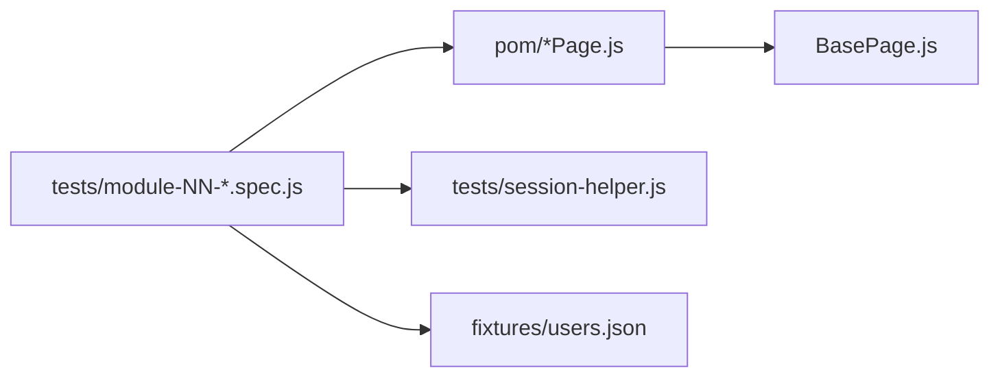

# ShopEase Playwright automation architecture

## Layout

| Folder / file | Role |
|---------------|------|
| `playwright.config.js` | Parallel runs, HTML report, optional `webServer`, `baseURL` |
| `fixtures/users.json` | Seeded admin + customer credentials |
| `tests/session-helper.js` | API login, cart clear, inject `localStorage` for UI tests (kept next to specs so it is not missed when copying) |
| `utils/api-session.js` | Optional re-export of `session-helper` |
| `utils/waits.js` | Small wait helpers |
| `utils/logger.js` | Log helper |
| `pom/*.js` | **10 module Page Objects** (+ shared `BasePage.js`) |
| `tests/module-NN-*.spec.js` | **10 spec files**, **15 tests each** (150 total) |

## Page Object Model (10 modules)

1. `LoginPage.js` — Module 01 · Login  
2. `RegisterPage.js` — Module 02 · Register  
3. `PasswordRecoveryPage.js` — Module 03 · Forgot / Reset  
4. `HomePage.js` — Module 04 · Catalog / Home  
5. `ProductPage.js` — Module 05 · Product details  
6. `CartPage.js` — Module 06 · Cart  
7. `CheckoutPage.js` — Module 07 · Checkout & payment  
8. `OrdersPage.js` — Module 08 · Orders  
9. `AdminDashboardPage.js` — Module 09 · Admin dashboard  
10. `AdminManagementPage.js` — Module 10 · Admin products / orders / users  

Shared: `BasePage.js` (navigation helper).

## Test modules (150 cases)

| File | Tests |
|------|--------|
| `module-01-login.spec.js` | 15 |
| `module-02-register.spec.js` | 15 (serial) |
| `module-03-password-recovery.spec.js` | 15 |
| `module-04-catalog.spec.js` | 15 |
| `module-05-product-details.spec.js` | 15 |
| `module-06-cart.spec.js` | 15 (serial) |
| `module-07-checkout-payment.spec.js` | 15 (serial) |
| `module-08-orders.spec.js` | 15 (serial) |
| `module-09-admin-dashboard.spec.js` | 15 |
| `module-10-admin-management.spec.js` | 15 |

**Serial** suites avoid races on the same seeded user’s cart / checkout.

## Diagram

