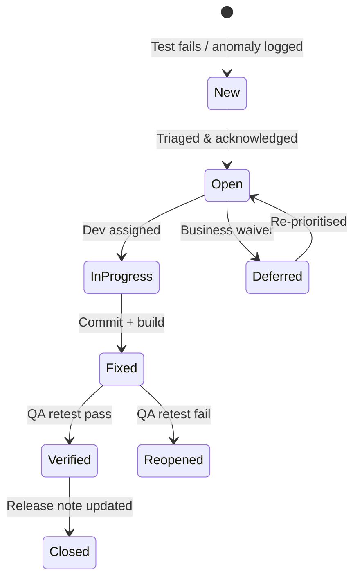

# Defect lifecycle

## SLA (example)

| Severity | Target fix | Target verify |
|----------|------------|---------------|
| Blocker | 24h | 24h |
| Critical | 48h | 48h |
| Major | 5d | 2d after fix |
| Minor | Sprint | Next regression |
